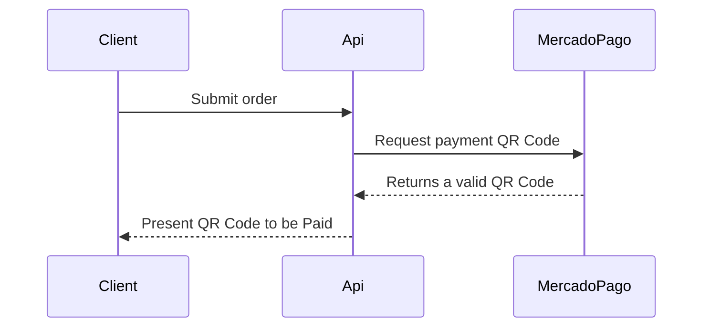
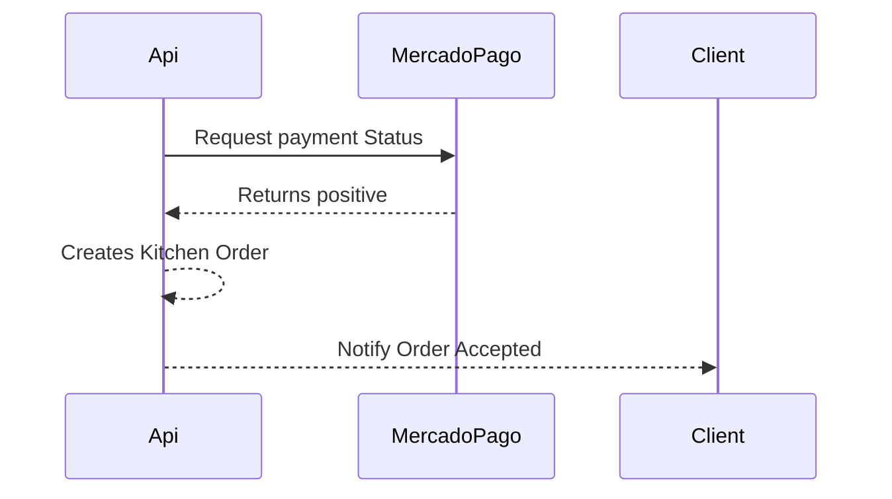

# SnackHub

This is the source code for SnackHub, designed to be the first step of FIAP's SOAT Tech Challenges.<br>
It intends to apply the concepts presented so far, such as Domain Driven Design, Containerization and Hexagonal Architecture.<br>

The API handles a few operations on a small fast food restaurant, including: <br>
The application touches some domains and let the user execute some use cases, they are:

- Clients domain
  - Create new clients;
  - Get a registered client by `Id` or by `CPF`;
- Products domain
  - Create, Update and Delete products;
  - Get a product by Id;
  - Get a `list of products` by `Category`;
  - Get a list containing all registered products;
- Order domain
  - Confirm a new order by passing a client identifier and registered products;
  - Cancel a non-accept(non-paid) order;
  - `Checkout/Pay` the order, creating a new `Kitchen Order`;
- Kitchen Order domain
  - Get a `list containing all registered Kitchen orders approved/created`;
  - Update the `Kitchen order state`;

## Documentation
This application is based on DDD and you can find the `Event Storm` diagrams and `Ubiquitous Language` by following those links:  
 - [Event Storm](https://miro.com/app/board/uXjVKUq0krI=/?share_link_id=69852294691)
 - [Ubiquitous Language](https://funny-language-87c.notion.site/Linguagem-Ub-qua-4edadb2ca03e438e8df846940bfe90b3)

## Kubernetes Cloud Architecture
The application is designed to be deployed on a Kubernetes cluster, it is a simple architecture, but it is enough to show how it can be done. The architecture is composed by the following services:


## Running the Application

This application is a webapi, based on `dotnet core`, to make it easy to execute it, it makes use of `docker/docker compose`.
So, `please, make sure you have docker and docker compose installed at your environment`.

### Using Docker Compose
<details>
  <summary>Click me</summary>
  For a simpler setup, `navigate to the folder /deploy at solutions root folder in your terminal and execute`:
  
  ```sh
  docker compose up -d
  ```
  This command will automatically build and start all the necessary services, including the `SnackHub api` and `MongoDB`, based on the configuration in the `docker-compose.yml` file.
  The api will expose two main endpoint, they are:

  - A http endpoint, that can be access by: http://localhost:5000

  In order to make it simpler to test, it exposes swagger as a way to interact with the api, it can be accessed at:
  - http://localhost:5000/swagger
  
  ### Cleanning the environment after applicatoin execution - Optional

  <details>
  
  To clean up your environment after test execution, you can simply execute the following command at the `same path you had executed the docker compose up -d` command:
  
  ```shell
  docker compose down --rmi all --remove-orphans --volumes
  ```
  
  </details>
</details>

### Using Kubernetes
<details>
  <summary>Click me</summary>
    Ensure your Kubernetes cluster is running. 
    Navigate to the folder ./deploy at solutions root folder in your terminal and execute:

    PowerShell -ExecutionPolicy Bypass -File .\deploy_kubernetes.ps1
</details>

## Application folder Structure
<details>

```sh
.
├── deploy
│   ├── docker-compose.yml
│   └── Dockerfile
├── launchSettings.json
├── LICENSE
├── Makefile
├── README.md
├── SnackHub.sln
├── src
│   ├── SnackHub.Api
│   │   ├── appsettings.Development.json
│   │   ├── appsettings.json
│   │   ├── Configuration
│   │   │   ├── MongoDbSettings.cs
│   │   │   └── StorageSettings.cs
│   │   ├── Controllers
│   │   │   ├── ClientController.cs
│   │   │   ├── KitchenOrderController.cs
│   │   │   ├── OrderController.cs
│   │   │   └── ProductController.cs
│   │   ├── Extensions
│   │   │   ├── AddNotificationsExtensions.cs
│   │   │   ├── MongoDbExtensions.cs
│   │   │   ├── RepositoriesExtensions.cs
│   │   │   ├── ServicesExtensions.cs
│   │   │   ├── UseCasesExtensions.cs
│   │   │   └── ValidatorsExtensions.cs
│   │   ├── Program.cs
│   │   ├── Properties
│   │   │   └── launchSettings.json
│   │   ├── SnackHub.Api.csproj
│   │   └── SnackHub-Poc.http
│   ├── SnackHub.Application
│   │   ├── Client
│   │   │   ├── Contracts
│   │   │   │   ├── IGetClientUseCase.cs
│   │   │   │   ├── IRegisterClientUseCase.cs
│   │   │   │   └── IRegisterClientValidator.cs
│   │   │   ├── Models
│   │   │   │   ├── GetClientResponse.cs
│   │   │   │   ├── RegisterClientRequest.cs
│   │   │   │   └── RegisterClientResponse.cs
│   │   │   └── UseCases
│   │   │       ├── GetClientUseCase.cs
│   │   │       ├── RegisterClientUseCase.cs
│   │   │       └── RegisterClientValidator.cs
│   │   ├── KitchenOrder
│   │   │   ├── Contracts
│   │   │   │   ├── ICreateKitchenOrderUseCase.cs
│   │   │   │   ├── IListKitchenOrdertUseCase.cs
│   │   │   │   └── IUpdateKitchenOrderStatusUseCase.cs
│   │   │   ├── Models
│   │   │   │   ├── CreateKitchenOrderRequest.cs
│   │   │   │   ├── CreateKitchenOrderResponse.cs
│   │   │   │   ├── KitchenOrderResponse.cs
│   │   │   │   ├── UpdateKitchenOrderStatusRequest.cs
│   │   │   │   └── UpdateKitchenOrderStatusResponse.cs
│   │   │   └── UseCases
│   │   │       ├── CreateKitchenOrderUseCase.cs
│   │   │       ├── ListKitchenOrdertUseCase.cs
│   │   │       └── UpdateKitchenOrderStatusUseCase.cs
│   │   ├── Order
│   │   │   ├── Contracts
│   │   │   │   ├── ICancelOrderUseCase.cs
│   │   │   │   ├── ICheckoutOrderUseCase.cs
│   │   │   │   ├── IConfirmOrderUseCase.cs
│   │   │   │   └── IListOrderUseCase.cs
│   │   │   ├── Models
│   │   │   │   ├── CancelOrderRequest.cs
│   │   │   │   ├── CancelOrderResponse.cs
│   │   │   │   ├── CheckoutOrderRequest.cs
│   │   │   │   ├── CheckoutOrderResponse.cs
│   │   │   │   ├── ConfirmOrderRequest.cs
│   │   │   │   ├── ConfirmOrderResponse.cs
│   │   │   │   └── OrderResponse.cs
│   │   │   └── UseCases
│   │   │       ├── CancelOrderUseCase.cs
│   │   │       ├── CheckoutOrderUseCase.cs
│   │   │       ├── ConfirmOrderUseCase.cs
│   │   │       └── ListOrderUseCase.cs
│   │   ├── Payment
│   │   │   ├── Contracts
│   │   │   │   └── IPaymentGatewayService.cs
│   │   │   ├── Models
│   │   │   │   ├── CreditCard.cs
│   │   │   │   ├── OnTheHouse.cs
│   │   │   │   ├── PaymentMethod.cs
│   │   │   │   ├── PaymentRequest.cs
│   │   │   │   ├── PaymentResponse.cs
│   │   │   │   └── PaymentStatus.cs
│   │   │   └── Services
│   │   │       └── FakePaymentGatewayService.cs
│   │   ├── Product
│   │   │   ├── Contracts
│   │   │   │   ├── IGetByCategoryUseCase.cs
│   │   │   │   ├── IGetProductUseCase.cs
│   │   │   │   └── IManageProductUseCase.cs
│   │   │   ├── Models
│   │   │   │   ├── GetProductResponse.cs
│   │   │   │   ├── ManageProductRequest.cs
│   │   │   │   └── ManageProductResponse.cs
│   │   │   └── UseCases
│   │   │       ├── GetByCategoryUseCase.cs
│   │   │       ├── GetProductUseCase.cs
│   │   │       └── ManageProductUseCase.cs
│   │   └── SnackHub.Application.csproj
│   ├── SnackHub.Domain
│   │   ├── Base
│   │   │   ├── DomainException.cs
│   │   │   ├── Entity.cs
│   │   │   ├── IAggregateRoot.cs
│   │   │   └── ValueObject.cs
│   │   ├── Contracts
│   │   │   ├── IClientRepository.cs
│   │   │   ├── IKitchenOrderRepository.cs
│   │   │   ├── IOrderRepository.cs
│   │   │   └── IProductRepository.cs
│   │   ├── Entities
│   │   │   ├── CategoryEnum.cs
│   │   │   ├── Client.cs
│   │   │   ├── KitchenOrder.cs
│   │   │   ├── Order.cs
│   │   │   └── Product.cs
│   │   ├── SnackHub.Domain.csproj
│   │   └── ValueObjects
│   │       ├── CPF.cs
│   │       ├── KitchenOrderStatus.cs
│   │       ├── KitchenOrdertItem.cs
│   │       ├── OrderItem.cs
│   │       └── OrderStatus.cs
│   └── SnackHub.Infra
│       ├── Repositories
│       │   ├── Abstractions
│       │   │   └── IBaseRepository.cs
│       │   ├── InMemory
│       │   │   ├── ClientRepository.cs
│       │   │   └── ProductRepository.cs
│       │   └── MongoDB
│       │       ├── BaseRepository.cs
│       │       ├── ClientRepository.cs
│       │       ├── KitchenOrderRepository.cs
│       │       ├── OrderRepository.cs
│       │       └── ProductRepository.cs
│       └── SnackHub.Infra.csproj
└── test
    ├── SnackHub.Application.Tests
    │   ├── Services
    │   │   └── FakePaymentGatewayServiceShould.cs
    │   ├── SnackHub.Application.Tests.csproj
    │   └── UseCases
    │       ├── CancelOrderShould.cs
    │       ├── CheckoutOrderShould.cs
    │       ├── ConfirmOrderShould.cs
    │       ├── GetClientShould.cs
    │       ├── GetProductsByCategoryShould.cs
    │       ├── RegisterClientShould.cs
    │       └── RegisterClientValidatorShould.cs
    └── SnackHub.Domain.Tests
        ├── Entities
        │   └── OrderShould.cs
        ├── SnackHub.Domain.Tests.csproj
        └── ValueObjects
            ├── CPFShould.cs
            └── OrderItemShould.cs
```
</details>

## Testing this application
First of all, the system should have a client to be used. It could be an anonymous one if you wish.
Bellow, we have a curl command that will create a user named: `Anonymous Client` with a [valid brazilian CPF generated at](https://www.4devs.com.br/gerador_de_cpf),

### Creating a new user

```shell
curl -X 'POST' \
  'http://localhost:5000/api/Client/v1' \
  -H 'accept: text/plain' \
  -H 'Content-Type: application/json' \
  -d '{
  "name": "Anonymous Client",
  "cpf": "10097159093"
}'
```

As a response, you should have a return similar to this:
```json
{"id":"e46569a7-635b-4d05-b488-fa92d9f9fc41","notifications":[],"isValid":true}
```

### Verifying clients

At this moment, you can verify client by using one of those endpoints bellow:

<details>

#### Get client by Id

```shell
curl -X 'GET' \
  'http://localhost:5000/api/Client/v1/{client-id}' \
  -H 'accept: text/plain'
```

#### Get client by CPF
```shell
curl -X 'GET' \
  'http://localhost:5000/api/Client/v1/{client-cpf}' \
  -H 'accept: text/plain'
```

</details>

### Adding products

To allow the client to submit an `Order`, we need to have products available at the system.<br>
At this moment, we have possibility to enter some product categories, they are:

  - Snack = 0;
  - SupportDish = 1;
  - Drink = 2;
  - Dessert = 3;

We can do that by executing a `POST` request at `api/Product/v1` endpoint. So, supposing a situation to add a snack and a drink, we have to send two requests, like the example bellow:

#### Snack
```shell
curl -X 'POST' \
  'http://localhost:5000/api/Product/v1' \
  -H 'accept: text/plain' \
  -H 'Content-Type: application/json' \
  -d '{
  "name": "X-Tudo",
  "category": 0,
  "price": 14.5,
  "description": "Delicious Brazilian sandwich"
}'
```

#### Drink

```shell
curl -X 'POST' \
  'http://localhost:5000/api/Product/v1' \
  -H 'accept: text/plain' \
  -H 'Content-Type: application/json' \
  -d '{
  "name": "Coca-Cola",
  "category": 2,
  "price": 4,
  "description": "Soft drink"
}'
```

You can add, remove and edit as many products you wish.
In order to list all products we have at the system, it is available a `GET` endpoint at: `api/Product/v1`

```shell
curl -X 'GET' \
  'http://localhost:5000/api/Product/v1' \
  -H 'accept: text/plain'
```

if executed the command to create products above, it should return a response similar to:

```shell
[
  {
    "id": "828b9890-5705-4f12-bfea-195fff4a5203",
    "name": "X-Tudo",
    "category": 0,
    "price": 14.5,
    "description": "Delicious Brazilian sandwich",
    "images": []
  },
  {
    "id": "6728d665-f255-4b9c-af45-b23fae7a9f04",
    "name": "Coca-Cola",
    "category": 2,
    "price": 4,
    "description": "Soft drink",
    "images": []
  }
]
```

### Submitting an Order

Now that we already have a `client` and some `products`, we can submit a new `Order`.
Basically, the order receives a client and a `list of products and quantities`, returning if valid, and `order identifier` and a `total amount value` for that `order summation`  

For doing that, is there a `POST` endpoint, `api/Order/v1/Confirm`. <br>
This endpoint receives a `json body payload`, and it contains some special details. It expects to have a `client identifier`. So, at the "identifier" property, `should be passed` a user `CPF` or `Id`. <br>

One submition payload could be:

```shell
curl -X 'POST' \
  'http://localhost:5000/api/Order/v1/Confirm' \
  -H 'accept: text/plain' \
  -H 'Content-Type: application/json' \
  -d '{
  "identifier": "{user-cpf-or-id}",
  "items": [
    {
      "productId": "{product-one-id}",
      "quantity": 2
    },
    {
      "productId": "{product-two-id}",
      "quantity": 2
    }
  ]
}'
```

The response data should be something similar to:

```shell
{
  "orderId": "73d1d9d6-d969-4b50-83ff-bf41cc3b9b0e",
  "total": 37,
  "notifications": [],
  "isValid": true
}
```
Where the total, is the sum of all products values and quantities that composed that order submission.

### Listing orders

<details>

The api provides an endpoint to list all orders submitted. It can be found at `api/Order/v1`.
A curl example can be:

```shell
curl -X 'GET' \
  'http://localhost:5000/api/Order/v1' \
  -H 'accept: text/plain'
```

</details>

### Order (fake)Checkout

This process is one of the most important actions from the system. Here, it tries to verify if the payment went well, if so, the `Order state` will be changed to `Confirmed` and a new `Kitchen Order` will be automatically created. if not, it will keep it open for a while, expecting to have a positive response in a near future.
Basically, it is a `POST` endpoint, that should receive at its payload, an `order identifier`. The endpoint is: `api/Order/v1/Checkout`.

Follows a CURL example:

```shell
curl -X 'POST' \
  'http://localhost:5000/api/Order/v1/Checkout' \
  -H 'accept: text/plain' \
  -H 'Content-Type: application/json' \
  -d '{
  "orderId": "{orderId}"
}'
```

It was design so simulate a checkout done by [MercadoPago](https://www.mercadopago.com.br/pagar-com-qr), so, it will simulate an integration with an external service. Something like the sequence diagram bellow  

#### Basic sequence diagram:

##### Submitting order


##### Fake checkout



### Kitchen Order
At this point, we should be able to `List` all `kitchen orders` and update its status.
To list all order, there is the `GET` endpoint `api/KitchenOrder/v1`. 

After the checkout, you can execute the following CURL command if you wish:
```shell
curl -X 'GET' \
  'http://localhost:5000/api/KitchenOrder/v1' \
  -H 'accept: text/plain'
```

The order status can be changes by using the following `POST` endpoint `api/KitchenOrder/v1/UpdateStatus` and it just receives the order identifier as argument.
```shell
curl -X 'PUT' \
  'http://localhost:5000/api/KitchenOrder/v1/UpdateStatus' \
  -H 'accept: text/plain' \
  -H 'Content-Type: application/json' \
  -d '{
  "orderId": "73d1d9d6-d969-4b50-83ff-bf41cc3b9b0e"
}'
```
The order can have only those states:

  - Received = 0,
  - Preparing = 1,
  - Done = 2,
  - Finished = 3,

## Stack

- C# 12
- .Net 8
- mongodb
- Docker
- Docker compose

## External dependencies

At this moment, this application rely only on [MongoDb](https://www.mongodb.com/) as it is the main storage of this
application.

## Variables/Docker Env

The application need to be configured with some variables, as follows

| Variable Name            | Value/default         | Type    |
|--------------------------|-----------------------|---------|
| Storage:MongoDb:Host     | localhost / 127.0.0.1 | string  |
| Storage:MongoDb:Port     | 27017                 | integer |
| Storage:MongoDb:UserName | admin                 | string  |
| Storage:MongoDb:Password | admin                 | string  |
| Storage:MongoDb:Database | snackhub              | string  |

When executing the api through the `docker compose`, it will be configured by using the `.env` file found at the solutions root folder.